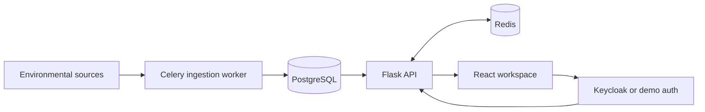

# Droplet

Droplet isa work-in-progress web application for tracking Germany's climate data. It provides an operational dashboard with an interactive map, trends visualization and AI analysis along with different user authentication levels.

Development is currently 'not-even-an-alpha' stage, so there are lot more to come in the near future not in a particular order.
- Climate data is only rendered on the dashboard. The goal is to consume the climate data on Trends and AI Analysis pages.
- Auth improvements. Current auth workflow needs a cleanup.
- Design overhaul. The design language of Droplet comes from shadcn/ui component library. It looks good but devoids character.

Feel free to check out the Github Repo for Droplet.
[https://github.com/kabaskill/droplet](https://github.com/kabaskill/droplet)

The repo also provides documentation on various aspects of the app, which can be found on /docs
- How to Use Droplet: user-facing guide for navigation, roles, refreshes, and AI analysis.
- Data Flow: how environmental data moves from sources into snapshots, read models, caches, and the frontend.
- Source Normalization: backend-only climate source normalization for water/weather, sunlight, air quality, and exploratory CO2 context.
- Snapshot Model And Calculations: transparent explanation of source handling, snapshot structures, scoring formulas, and known limitations.
- Architecture: service layout, runtime components, backend layers, frontend layers, and deployment notes.
- Production Readiness: what is already production-shaped and what must be hardened before real SaaS operation.
- Interview Notes: concise talking points for presenting Droplet in a senior full stack interview.
- Auth Modes: demo auth and local Keycloak setup.
- Prototype Architecture: original resilience notes.

## System Design Summary

Droplet stores normalized reservoir snapshots in PostgreSQL. The backend builds stable read models from those snapshots, caches frequently used responses in Redis, and serves them to the React app through authenticated API endpoints.

