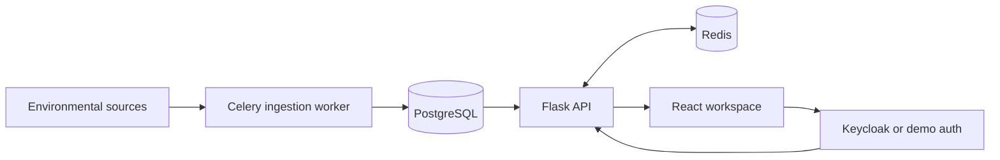

# Droplet Docs

Droplet is Germany's Water State Platform: an operational dashboard for monitoring regional water conditions, source freshness, forecast pressure, and AI-assisted observations.

## Documents

- [How to Use Droplet](./docs/usage.md): user-facing guide for navigation, roles, refreshes, and AI analysis.
- [Data Flow](./docs/dataflow.md): how environmental data moves from sources into snapshots, read models, caches, and the frontend.
- [Source Normalization](./docs/source-normalization.md): backend-only climate source normalization for water/weather, sunlight, air quality, and exploratory CO2 context.
- [Snapshot Model And Calculations](./docs/snapshot-model-and-calculations.md): transparent explanation of source handling, snapshot structures, scoring formulas, and known limitations.
- [Architecture](./docs/architecture.md): service layout, runtime components, backend layers, frontend layers, and deployment notes.
- [Production Readiness](./docs/production-readiness.md): what is already production-shaped and what must be hardened before real SaaS operation.
- [Interview Notes](./docs/interview-notes.md): concise talking points for presenting Droplet in a senior full stack interview.
- [Auth Modes](./docs/auth.md): demo auth and local Keycloak setup.
- [Prototype Architecture](./docs/prototype-architecture.md): original resilience notes.

## System At A Glance

Droplet stores normalized reservoir snapshots in PostgreSQL. The backend builds stable read models from those snapshots, caches frequently used responses in Redis, and serves them to the React app through authenticated API endpoints.
