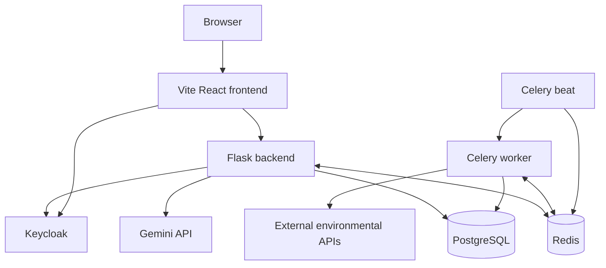
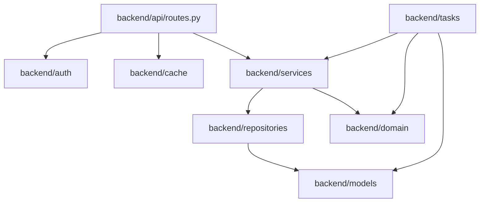
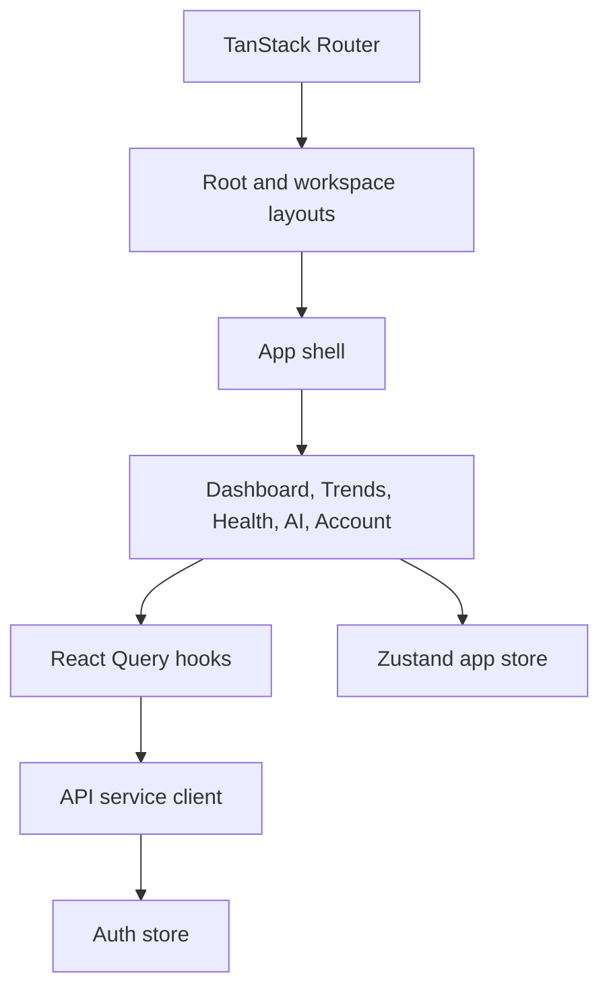
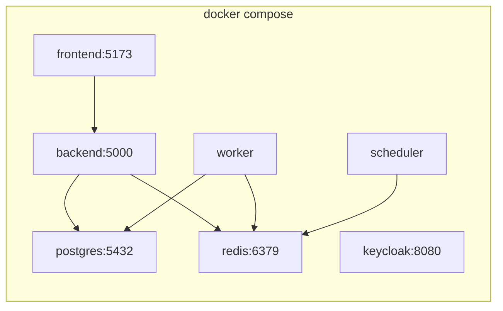

# Architecture

Droplet is a Dockerized React and Flask application with PostgreSQL persistence, Redis caching, Celery background work, and optional Keycloak authentication.

## Runtime Components

## Services

| Service | Location | Responsibility |
|---|---|---|
| `frontend` | `frontend/` | React workspace, routing, panels, query cache, auth client. |
| `backend` | `backend/` | Flask API, auth enforcement, repositories, read models, AI proxy. |
| `worker` | `backend/tasks/ingestion.py` | Snapshot refresh and cache invalidation. |
| `scheduler` | `backend/workers/celery_app.py` | Periodic ingestion every `SNAPSHOT_REFRESH_INTERVAL_MINUTES`. |
| `postgres` | Docker image | Regions, snapshots, and AI analysis records. |
| `redis` | Docker image | API read-model cache, Celery broker, Celery result backend. |
| `keycloak` | `infrastructure/keycloak/` | Local OIDC realm, users, client, and roles. |

## Backend Layers

Backend responsibilities are intentionally separated:

- `api/` exposes HTTP routes and status codes.
- `auth/` supports demo auth and Keycloak token validation.
- `cache/` wraps Redis read-through cache behavior and cache keys.
- `domain/` contains pure region and snapshot computation rules.
- `models/` defines SQLAlchemy database entities and sessions.
- `repositories/` maps database rows into API-friendly objects.
- `services/` builds read models, forecasts, source health, ingestion status, and AI analysis.
- `tasks/` runs ingestion in Celery and invalidates affected cache keys.
- `workers/` configures Celery broker, result backend, and beat schedule.

## Frontend Layers

Frontend responsibilities:

- `routes/` defines URL structure and shared layouts.
- `components/app/` contains operational pages and panels.
- `services/api.ts` owns HTTP calls, token attachment, error handling, and demo fallback.
- `hooks/use-droplet-data.ts` wraps server-state queries and mutations.
- `features/auth/` owns demo and Keycloak auth state.
- `stores/app-store.ts` owns local workspace state such as selected region and active layer.

## API Surface

| Method | Path | Auth | Description |
|---|---|---|---|
| `GET` | `/healthz` | No | Backend process health. |
| `GET` | `/api/auth/config` | No | Frontend auth configuration. |
| `GET` | `/api/auth/me` | Yes | Current user profile. |
| `GET` | `/api/regions` | Yes | Region metadata. |
| `GET` | `/api/snapshots` | Yes | Latest snapshot per region. |
| `GET` | `/api/snapshots/<region_id>` | Yes | Snapshot history with role-aware limit. |
| `POST` | `/api/snapshots/refresh` | Analyst or municipality | Queue or run snapshot ingestion. |
| `GET` | `/api/snapshots/refresh/<task_id>` | Analyst or municipality | Poll refresh status. |
| `GET` | `/api/ingestion/status` | Analyst or municipality | Last ingestion status. |
| `GET` | `/api/analytics/summary` | Analyst or municipality | Aggregate dashboard metrics. |
| `GET` | `/api/sources/health` | Analyst or municipality | Source coverage and confidence. |
| `GET` | `/api/forecasts/outlook` | Analyst or municipality | 48-hour forecast pressure outlook. |
| `POST` | `/api/ai/analyze` | Yes | Run AI analysis for one or more snapshots. |
| `GET` | `/api/ai/analyses` | Yes | List current user's saved analyses. |

## Deployment Shape

Local deployment is defined in `docker-compose.yml`.

Production-like concerns already represented in the architecture:

- API responses are CORS-limited through `CORS_ORIGINS`.
- Auth mode can switch from demo to Keycloak.
- Redis separates short-lived read-model caching from durable PostgreSQL data.
- Snapshot ingestion can run asynchronously through Celery or synchronously when the broker is unavailable.
- Read-model failures are isolated in the frontend so optional panels can fail without taking down the whole workspace.

## Key Environment Variables

| Variable | Used by | Default | Purpose |
|---|---|---|---|
| `DATABASE_URL` | backend, worker | compose Postgres URL | SQLAlchemy database connection. |
| `REDIS_URL` | backend, worker | `redis://localhost:6379/0` | Redis cache fallback URL. |
| `CELERY_BROKER_URL` | worker, scheduler, backend | Redis DB 0 | Celery task broker. |
| `CELERY_RESULT_BACKEND` | worker, backend | Redis DB 1 | Celery task status storage. |
| `AUTH_MODE` | backend | `demo` | Backend auth validation mode. |
| `VITE_AUTH_MODE` | frontend | `demo` | Frontend auth fallback mode. |
| `VITE_API_BASE_URL` | frontend | `/api` | API base path for browser requests. |
| `VITE_DEMO_FALLBACK` | frontend | enabled | Allows demo data fallback for non-auth API failures. |
| `GEMINI_API_KEY` | backend | empty | Enables AI analysis. |
| `GEMINI_MODEL` | backend | `gemini-2.5-flash` | Gemini model name. |
| `SNAPSHOT_RETENTION_DAYS` | worker | `395` | Snapshot retention window. |
| `SNAPSHOT_REFRESH_INTERVAL_MINUTES` | scheduler | `30` | Scheduled ingestion interval. |
