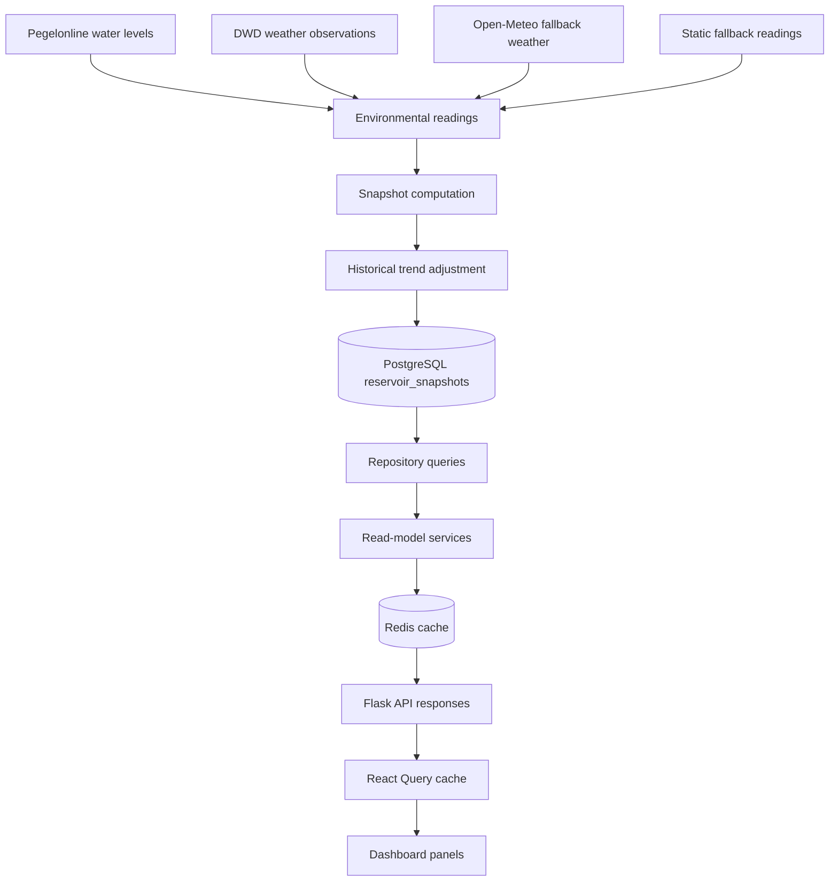
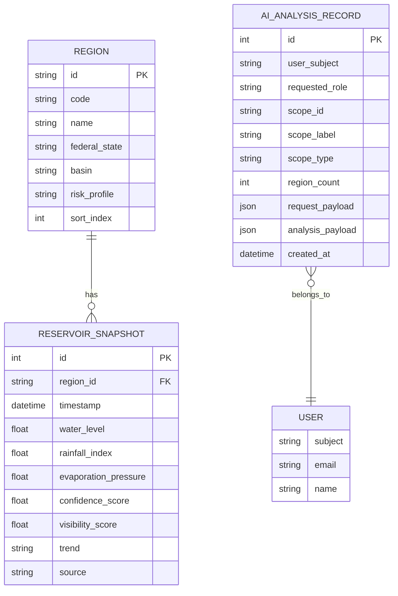
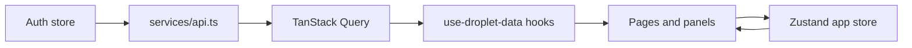
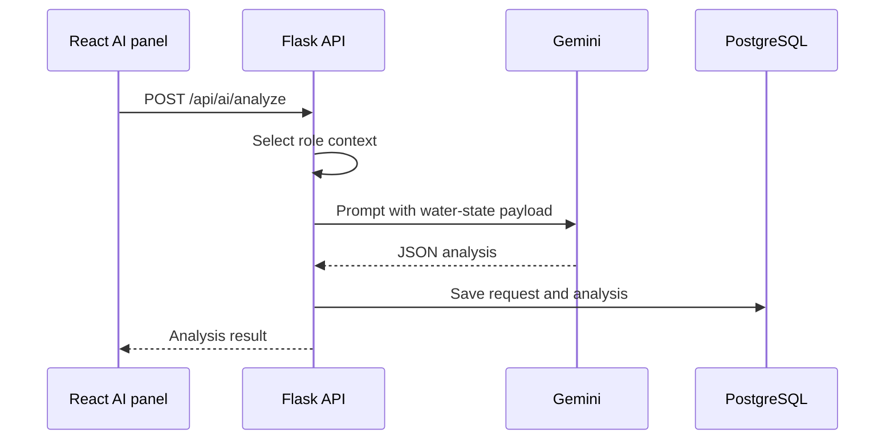

# Data Flow

Droplet converts live environmental observations into normalized reservoir snapshots, then exposes read models optimized for the frontend.

## End-To-End Flow

## Source Collection

The ingestion task starts with fallback readings for every supported German state. It then attempts to enrich each region with live sources:

- Pegelonline provides water-level observations.
- DWD provides temperature, humidity, and precipitation observations.
- Open-Meteo is used as weather fallback when DWD weather is unavailable.
- Static fallback readings keep the app usable when external sources fail.

Source failures are logged and isolated per region. A failed source does not stop the whole ingestion run.

## Snapshot Computation

Each `EnvironmentalReading` is converted into a `ComputedSnapshot`.

| Field | Meaning |
|---|---|
| `waterLevel` | Normalized water level from live station data or fallback centimeters. |
| `rainfallIndex` | Rainfall normalized to a 0-100 index. |
| `evaporationPressure` | Pressure estimate from temperature and humidity. |
| `confidenceScore` | Higher when more source parts contributed to the reading. |
| `visibilityScore` | Combined confidence, evaporation, and water-level signal. |
| `trend` | Initial rising, falling, or stable classification. |
| `source` | Compact source label shown in the UI. |
| `timestamp` | Source observation time or current UTC hour. |

After computation, the ingestion task compares each snapshot with the previous persisted snapshot for the same region. If water level changed by at least three points, the trend is adjusted to `rising` or `falling`; otherwise it remains `stable`.

## Persistence

`regions` are seeded by the backend at startup. `reservoir_snapshots` are inserted or updated by ingestion. `ai_analyses` stores user-scoped analysis history.

Old snapshots are pruned according to `SNAPSHOT_RETENTION_DAYS`, which defaults to `395`.

## Read Models

The backend builds several read models from persisted snapshots:

| Read model | Endpoint | Cache TTL | Purpose |
|---|---|---:|---|
| Regions | `/api/regions` | 3600s | Static state metadata. |
| Latest snapshots | `/api/snapshots` | 120s | Current map and detail state. |
| Snapshot history | `/api/snapshots/<region_id>` | 120s | Trend history for one state. |
| Analytics summary | `/api/analytics/summary` | 120s | Dashboard summary metrics. |
| Source health | `/api/sources/health` | 120s | Source coverage and reliability. |
| Forecast outlook | `/api/forecasts/outlook` | 900s | 48-hour pressure estimates. |
| AI analyses | `/api/ai/analyses` | none | User-specific analysis history. |

Cache keys are invalidated after snapshot ingestion creates, updates, or deletes data.

## Frontend Data Flow

The frontend uses:

- `services/api.ts` for authenticated HTTP requests and demo fallback.
- TanStack Query for server-state caching, loading, error, and retry behavior.
- `use-droplet-data.ts` hooks for stable query keys and role-aware history limits.
- A Zustand app store for selected region, active map layer, and regional filters.

## AI Analysis Flow

If `GEMINI_API_KEY` is missing or Gemini returns invalid output, the backend returns a 502 error and the frontend shows the panel-level failure.
