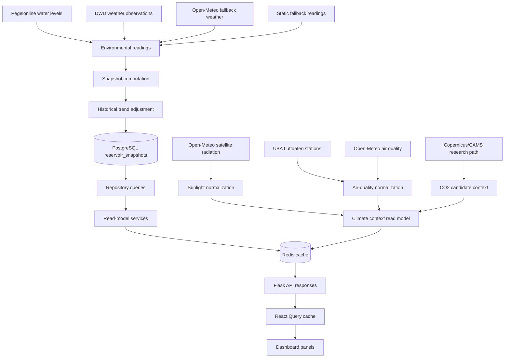
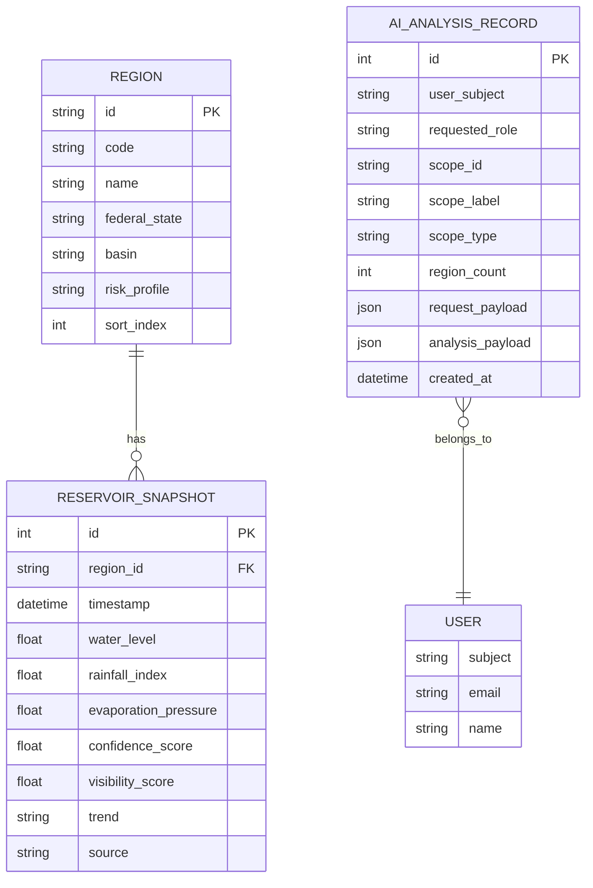
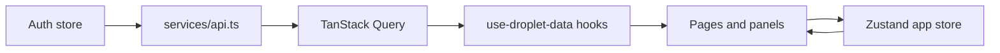
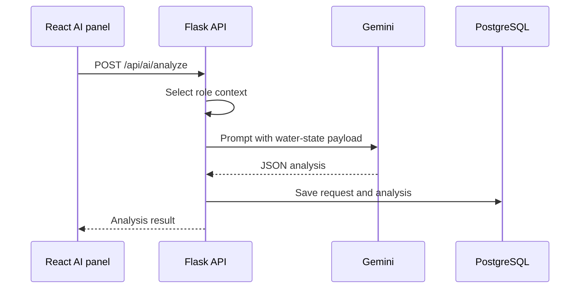

# Data Flow

Droplet converts live environmental observations into normalized reservoir snapshots, then exposes read models optimized for the frontend.

Climate source normalization for sunlight, air quality, and exploratory CO2 context is exposed as selected-region context. These normalized climate readings are not persisted into reservoir snapshots.

## End-To-End Flow

## Source Collection

The ingestion task starts with fallback readings for every supported German state. It then attempts to enrich each region with live sources:

- Pegelonline provides water-level observations.
- DWD provides temperature, humidity, and precipitation observations.
- Open-Meteo is used as weather fallback when DWD weather is unavailable.
- Static fallback readings keep the app usable when external sources fail.

Source failures are logged and isolated per region. A failed source does not stop the whole ingestion run.

## Climate Source Normalization

Climate source normalization is split by source family:

- `backend/services/climate_sources/solar.py` fetches Open-Meteo radiation fields, caches stable-flow source payloads with a 30-minute fresh window and three-hour stale fallback window, skips future archive rows, and normalizes current irradiance, clear-sky ratio, direct-light share, timestamp, source metadata, and a solar feasibility score.
- `backend/services/climate_sources/air_quality.py` selects UBA stations by pollutant coverage and freshness, fetches per-station pollutant measurements concurrently, detects stale selected pollutant readings, normalizes pollutant readings, caches UBA and Open-Meteo source payloads with stale fallback windows for the stable flow, and can use Open-Meteo air-quality data to fill missing readings or fall back when UBA is unavailable while preserving relevant fallback freshness warnings.
- `backend/services/climate_sources/co2.py` records the CAMS/Copernicus research candidate and expected normalization fields without blocking on credentials.
- `backend/services/climate_context.py` maps normalized source stages into the stable `/api/climate/regions/<region_id>` read model used by the selected-state Home workflow.

Raw source payloads are summarized for debug visibility only. The stable climate context endpoint exposes compact sunlight, air-quality, CO2 source status, normalized source labels, finite numeric fields, and sanitized source-cache warnings without raw responses, request config, or selected debug fields. Malformed climate-source numbers become `null` at the read-model boundary. The durable reservoir snapshot model continues to use the existing water/weather ingestion path until a later phase explicitly integrates climate signals into persistence.

## Snapshot Computation

Each `EnvironmentalReading` is converted into a `ComputedSnapshot`.

| Field | Meaning |
|---|---|
| `waterLevel` | Normalized water level from live station data or fallback centimeters. |
| `rainfallIndex` | Rainfall normalized to a 0-100 index. |
| `evaporationPressure` | Pressure estimate from temperature and humidity. |
| `confidenceScore` | Higher when more source parts contributed to the reading. |
| `visibilityScore` | Combined confidence, evaporation, and water-level signal. |
| `trend` | Initial rising, falling, or stable classification. |
| `source` | Compact source label shown in the UI. |
| `timestamp` | Source observation time or current UTC hour. |

After computation, the ingestion task compares each snapshot with the previous persisted snapshot for the same region. If water level changed by at least three points, the trend is adjusted to `rising` or `falling`; otherwise it remains `stable`.

## Persistence

`regions` are seeded by the backend at startup. `reservoir_snapshots` are inserted or updated by ingestion. `ai_analyses` stores user-scoped analysis history.

Old snapshots are pruned according to `SNAPSHOT_RETENTION_DAYS`, which defaults to `395`.

## Read Models

The backend builds several read models from persisted snapshots:

| Read model | Endpoint | Cache TTL | Purpose |
|---|---|---:|---|
| Regions | `/api/regions` | 3600s | Static state metadata. |
| Latest snapshots | `/api/snapshots` | 120s | Current map and detail state. |
| Snapshot history | `/api/snapshots/<region_id>` | 120s | Trend history for one state. |
| Analytics summary | `/api/analytics/summary` | 120s | Dashboard summary metrics. |
| Source health | `/api/sources/health` | 120s | Source coverage and reliability. |
| Forecast outlook | `/api/forecasts/outlook` | 900s | 48-hour pressure estimates. |
| Region climate context | `/api/climate/regions/<region_id>` | 300s fresh, 3600s stale by default | Selected-state sunlight, air quality, and CO2 source-status context. |
| AI analyses | `/api/ai/analyses` | none | User-specific analysis history. |

Snapshot-backed cache keys are invalidated after snapshot ingestion creates, updates, or deletes data. Climate context is not persisted snapshot state, so it uses versioned per-region stale-while-revalidate cache entries instead: a fresh read model is served for `CLIMATE_CONTEXT_FRESH_TTL_SECONDS`, stale entries can be served for `CLIMATE_CONTEXT_STALE_TTL_SECONDS`, and cache misses return a pending climate read model. The API route does not fetch upstream climate sources directly; it reads Redis, returns immediately, and queues Celery refresh work when data is missing, stale, legacy, or bypassed. Redis refresh locks prevent duplicate per-region climate jobs. The climate response includes a compact `cache` section so callers can see whether the payload was fresh, stale, legacy, a miss, or a cache bypass, plus whether refresh is idle, queued, locked, or failed. Celery can also enqueue climate context refreshes for all supported states on the `CLIMATE_CONTEXT_REFRESH_INTERVAL_MINUTES` schedule. Inside each refresh, stable-flow source caches reduce repeated UBA and Open-Meteo calls; source-cache windows are configurable separately for observation payloads and the UBA station index. If stale, legacy, or bypassed source-cache data contributes to a selected climate section, the section warnings explain that degraded cache state without exposing cache envelopes.

## Frontend Data Flow

The frontend uses:

- `services/api.ts` for authenticated HTTP requests and demo fallback.
- TanStack Query for server-state caching, loading, error, and retry behavior.
- `use-droplet-data.ts` hooks for stable query keys and role-aware history limits.
- A Zustand app store for selected region, active map layer, and regional filters.

The Home dashboard fetches climate context only for the active selected region. Because the stable climate endpoint is non-blocking, the frontend refetches selected-region climate on selection and mount, then treats backend cache metadata as authoritative for freshness. Local React Query persistence is versioned with the climate read model so older cache labels do not survive schema changes. The climate panel displays backend cache freshness, refresh state, fresh/stale window timestamps, and refresh failures when available. Climate loading, error, pending, and partial-source states are isolated inside the climate panel so map, snapshot, region detail, and forecast workflows continue to render when climate context is unavailable.

## AI Analysis Flow

If `GEMINI_API_KEY` is missing or Gemini returns invalid output, the backend returns a 502 error and the frontend shows the panel-level failure.
