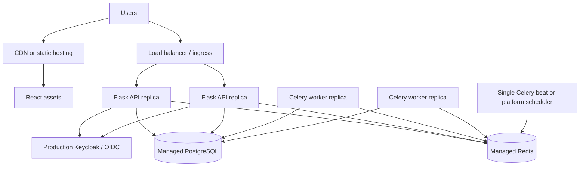

# Production Readiness

Droplet is a strong prototype architecture, but production use would require additional operational hardening. This document separates what is already represented from what should be added before running it as a real SaaS platform.

## Current Strengths

- Dockerized frontend, backend, worker, scheduler, PostgreSQL, Redis, and Keycloak services.
- React and TypeScript frontend with route-level protection, server-state caching, responsive layouts, and mobile workflows.
- Flask API with role-protected endpoints and a clear route, service, repository, model split.
- PostgreSQL persistence for regions, reservoir snapshots, and AI analysis history.
- Redis read-model caching and Celery broker/result backend.
- Celery worker and scheduler for slow ingestion jobs outside the request cycle.
- Keycloak/OIDC support with backend JWT validation and role-based authorization.
- AI integration behind the backend, with persisted analysis history and structured responses.
- Resilient read models with frontend fallback states for optional panels.

## Required Before Production

| Area | Current State | Production Step |
|---|---|---|
| Schema changes | SQLAlchemy models create the schema. | Add Alembic migrations and migration runbooks. |
| Secrets | Environment variables and local examples. | Use managed secrets, rotation, and least-privilege service credentials. |
| HTTPS | Local HTTP services. | Terminate TLS at ingress/load balancer and enforce HTTPS-only public traffic. |
| Scaling | Single local Compose services. | Run multiple backend and worker replicas behind managed infrastructure. |
| Database | Local PostgreSQL container. | Use managed PostgreSQL or hardened HA PostgreSQL with backups and restore testing. |
| Redis | Local Redis container. | Use managed Redis or persistent HA Redis with memory policies and monitoring. |
| Auth | Demo and local Keycloak realm. | Use production Keycloak realm/client config, token lifetimes, role governance, and audit logging. |
| Observability | Basic service health. | Add structured logs, metrics, tracing, dashboards, and alerts. |
| Rate limiting | Not yet implemented. | Rate-limit expensive endpoints such as refresh and AI analysis. |
| CI/CD | Not documented here. | Add automated build, lint, test, image scan, and deployment pipelines. |

## Deployment Shape

For production, Docker Compose should be treated as a local development topology. A production deployment should separate runtime responsibilities.

Key production rule: scale stateless services horizontally, keep durable state in managed or highly available data services, and run only one scheduler instance unless the scheduler uses leader election.

## Backend Hardening

- Add Alembic migrations instead of relying on model-driven table creation.
- Add a production WSGI server setup with multiple workers.
- Add database connection pooling and explicit pool limits.
- Add request timeouts around outbound environmental and AI calls.
- Add rate limits for:
  - `POST /api/snapshots/refresh`
  - `POST /api/ai/analyze`
  - high-cardinality history endpoints
- Add request IDs and structured JSON logs.
- Add health checks that distinguish process health from dependency health.
- Add audit logs for role-sensitive actions such as refresh and AI analysis.

## Frontend Hardening

- Serve built assets through a CDN or static hosting layer.
- Add security headers through the edge or reverse proxy.
- Keep runtime API base URLs environment-specific.
- Add frontend error reporting for render failures and failed critical workflows.
- Review token storage strategy for the target threat model.
- Keep mobile flows as first-class release checks because the target SaaS product is mobile-oriented.

## Data And Model Hardening

The snapshot scoring model is transparent but heuristic. Before production:

- Version the scoring model and store the version with each snapshot.
- Store raw source observations separately for auditability.
- Replace global water-level thresholds with gauge-specific warning bands or percentiles.
- Calibrate rainfall and evaporation thresholds with domain experts.
- Separate flood pressure and drought pressure instead of compressing both into a single elevated-risk count.
- Add fixed calculation test cases for known inputs and expected outputs.

## Queue And Cache Hardening

Redis currently handles both read-model caching and Celery coordination. That is acceptable for a prototype, but production should define clear operational boundaries.

- Consider separate Redis databases or separate Redis instances for cache and queue workloads.
- Add queue-depth alerts.
- Add retry and dead-letter handling for ingestion jobs.
- Add refresh deduplication so many users cannot enqueue the same ingestion work repeatedly.
- Track cache hit rate, cache memory, eviction rate, and stale read-model behavior.

## AI Hardening

- Add rate limits and quotas per user or tenant.
- Store prompt version and model name with every AI analysis.
- Validate AI output with a strict schema before saving it.
- Add privacy review for every field sent to the AI provider.
- Add fallback UI that explains when AI is unavailable without blocking core operations.
- Keep AI read-only unless a separate approval workflow is added.

## Security Checklist

- Disable demo auth in production.
- Restrict CORS to production frontend origins.
- Enforce HTTPS.
- Validate JWT issuer, expiry, signature, and expected client/audience.
- Use least-privilege database credentials.
- Keep Keycloak admin credentials out of application runtime.
- Add rate limiting and abuse protection.
- Add dependency scanning and image vulnerability scanning.
- Review logs to avoid leaking tokens, secrets, or sensitive payloads.

## Production Narrative

Droplet already demonstrates the desired architecture shape: React frontend, Flask API, durable SQL storage, Redis cache, asynchronous workers, OIDC auth, and AI integration. The next step is not a rewrite. The next step is operational maturity: migrations, observability, secrets, scaling, rate limiting, calibrated models, and CI/CD.
