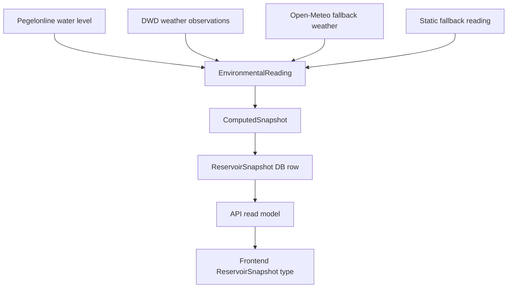
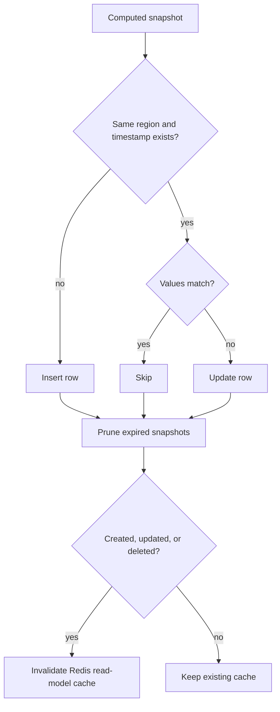

# Snapshot Model And Calculations

This document explains how Droplet turns environmental source data into reservoir snapshots, how those snapshots are stored, how API read models differ from database rows, and where the current scoring model is heuristic.

## Summary

Droplet does not store raw source payloads as the main application state. It fetches external readings, normalizes them into a small internal structure, computes a stable snapshot, stores that snapshot in PostgreSQL, then maps it into frontend-friendly JSON.



The current calculations are operational heuristics. They are useful for a prototype because they produce consistent 0-100 indicators, but they are not calibrated hydrological formulas.

## Source Data

The ingestion layer attempts to build one reading per supported German state.

| Source | Used for | Notes |
|---|---|---|
| Pegelonline | Current water level | Reads current gauge measurements for a configured water body and station target. |
| DWD CDC | Temperature, humidity, rainfall | Uses nearest active DWD stations for temperature/humidity and precipitation. |
| Open-Meteo | Weather fallback | Used when DWD weather data is not available. |
| Static fallback values | Complete fallback reading | Keeps every region usable when external sources fail. |

The region-to-source targeting is defined in `backend/services/environmental_sources.py`. Static fallback values are defined in `backend/domain/regions.py` as `STATE_READING_VALUES`.

Source failures are isolated. If DWD fails for one region, that region can still use Pegelonline water data plus fallback weather. If both live water and live weather fail, the static fallback reading remains.

## Internal Ingestion Structure

Before a snapshot is computed, source data is represented as `EnvironmentalReading`.

```python
EnvironmentalReading(
    humidity_percent=70,
    rainfall_mm=24,
    source="Pegelonline W: DONAU/PASSAU DONAU, DWD CDC: ...",
    temperature_c=16,
    water_level_cm=418,
    observed_at=datetime(...),
    normalized_water_level=64,
)
```

| Field | Meaning |
|---|---|
| `humidity_percent` | Relative humidity used for evaporation pressure and confidence. |
| `rainfall_mm` | Recent rainfall amount used for rainfall pressure. |
| `source` | Human-readable source label that is later split into source components. |
| `temperature_c` | Air temperature used for evaporation pressure. |
| `water_level_cm` | Raw gauge water level in centimeters. |
| `observed_at` | Source observation timestamp. If missing, ingestion uses the current UTC hour. |
| `normalized_water_level` | Optional pre-normalized water level from source characteristics. |

This structure is intentionally smaller than the source payloads. It keeps the rest of the app independent from Pegelonline, DWD, and Open-Meteo response shapes.

## Snapshot Structure

The computed domain object is `ComputedSnapshot`.

```python
ComputedSnapshot(
    confidence_score=86,
    evaporation_pressure=31,
    rainfall_index=53,
    source="Pegelonline W: ..., DWD CDC: ...",
    timestamp=datetime(...),
    trend="stable",
    visibility_score=72,
    water_level=64,
)
```

The database entity is `ReservoirSnapshot`.

```python
ReservoirSnapshot(
    id=123,
    region_id="bavaria",
    timestamp=datetime(...),
    water_level=64,
    rainfall_index=53,
    evaporation_pressure=31,
    confidence_score=86,
    visibility_score=72,
    trend="stable",
    source="Pegelonline W: ..., DWD CDC: ...",
)
```

PostgreSQL stores durable facts:

- which region the snapshot belongs to
- when the observation happened
- normalized operational scores
- trend
- source label

It does not store frontend-only fields such as `ageMinutes`, `freshnessStatus`, or parsed source components. Those are derived at read time.

## Frontend Read Model

The backend maps database rows into frontend JSON in `backend/repositories/mappers.py`.

```ts
type ReservoirSnapshot = {
  id?: number
  regionId: string
  timestamp: string
  waterLevel: number
  rainfallIndex: number
  evaporationPressure: number
  confidenceScore: number
  visibilityScore: number
  trend: "falling" | "rising" | "stable"
  source: string
  sources?: Array<{
    kind: "fallback" | "model" | "water" | "weather"
    label: string
  }>
  ageMinutes?: number
  freshnessStatus?: "current" | "old" | "stale"
}
```

The app converts the DB entity into this shape for three reasons:

1. Frontend naming conventions: TypeScript uses camelCase fields like `regionId`; SQLAlchemy uses snake_case fields like `region_id`.
2. UI convenience: the frontend needs `ageMinutes`, `freshnessStatus`, and parsed source components without recalculating them in every component.
3. API stability: the database can evolve without forcing the UI to know about internal table names or relationships.

Freshness is calculated from the snapshot timestamp:

| Age | Status |
|---:|---|
| `0-120` minutes | `current` |
| `121-360` minutes | `stale` |
| `>360` minutes | `old` |

## Calculation Pipeline

The core calculation happens in `compute_snapshot()` in `backend/domain/snapshots.py`.

All operational scores are clamped to a 0-100 range:

```python
clamp(value, minimum=0, maximum=100)
```

This prevents unusually large or small source values from breaking the UI scale.

## Water Level

If Pegelonline provides a normalized water level based on station characteristics, Droplet uses it:

```python
water_level = clamp(reading.normalized_water_level)
```

Otherwise it falls back to a simple centimeter scale:

```python
water_level = clamp((reading.water_level_cm / 650) * 100)
```

Reasoning:

- The UI needs a consistent 0-100 scale across regions.
- A normalized source value is preferred when available.
- The `650 cm` fallback denominator is a prototype-wide maximum reference value.

Transparency note: using one `650 cm` scale for every region is not hydrologically precise. Real deployment should use gauge-specific min/max bands, warning levels, or historical percentiles.

## Rainfall Index

```python
rainfall_index = clamp((reading.rainfall_mm / 45) * 100)
```

Reasoning:

- The app represents rainfall pressure on a 0-100 scale.
- `45 mm` maps to `100`.
- Higher rainfall is capped at `100`.

Transparency note: `45 mm` is a heuristic threshold. It should eventually become region-aware and time-window-aware.

## Evaporation Pressure

```python
evaporation_pressure = clamp(
    ((reading.temperature_c - 5) * 2.3)
    + ((100 - reading.humidity_percent) * 0.55)
)
```

Reasoning:

- Higher temperature increases evaporation pressure.
- Lower humidity increases evaporation pressure.
- The formula starts temperature pressure above `5 C`.
- The two weights produce a practical 0-100 operational indicator.

Example:

```text
temperature = 25 C
humidity = 40%

temperature contribution = (25 - 5) * 2.3 = 46
humidity contribution = (100 - 40) * 0.55 = 33
evaporation pressure = 79
```

Transparency note: this is not a physical evaporation model. It is a simple dryness/heat pressure score.

## Confidence Score

```python
source_count = len([part for part in reading.source.split(",") if part.strip()])

confidence_score = clamp(
    55
    + source_count * 11
    + min(reading.humidity_percent, 80) * 0.1
)
```

Reasoning:

- The base score is `55`, so even fallback snapshots are usable but visibly imperfect.
- More source components increase confidence.
- Humidity adds a small stabilizing contribution.

Interpretation:

| Higher confidence means | It does not mean |
|---|---|
| More complete or reliable source coverage. | Scientifically proven correctness. |

Transparency note: humidity's contribution to confidence is debatable. A cleaner model would base confidence only on source quality, recency, completeness, and station reliability.

## Visibility Score

```python
visibility_score = clamp(
    (confidence_score * 0.62)
    + ((100 - evaporation_pressure) * 0.18)
    + (water_level * 0.2)
)
```

Reasoning:

- Confidence is the dominant factor.
- Lower evaporation pressure improves visibility because conditions are less stressed.
- Water level contributes to the strength of the visible water-state signal.

| Score | Meaning |
|---|---|
| `confidenceScore` | Trust in the input data coverage. |
| `visibilityScore` | Operational clarity or usefulness of the resulting snapshot. |

Visibility is not the same as correctness. Correctness would require validation against ground truth.

## Initial Trend

The first trend estimate is based on current values:

```python
if water_level > 70 or rainfall_index > 68:
    trend = "rising"
elif water_level < 48 or evaporation_pressure > 60:
    trend = "falling"
else:
    trend = "stable"
```

Reasoning:

- High water level or rainfall suggests rising water pressure.
- Low water level or high evaporation pressure suggests falling/drying pressure.
- Values in the middle are treated as stable.

Transparency note: these thresholds are product heuristics. They are not currently region-specific.

## Historical Trend Adjustment

During ingestion, the new snapshot is compared to the previous snapshot for the same region:

```python
water_level_delta = snapshot.water_level - previous_snapshot.water_level

if water_level_delta >= 3:
    trend = "rising"
elif water_level_delta <= -3:
    trend = "falling"
else:
    trend = "stable"
```

Reasoning:

- Trend should reflect movement, not just absolute level.
- A three-point movement on the 0-100 scale is treated as meaningful.
- Small changes are treated as stable to avoid noisy status changes.

This historical adjustment overrides the initial trend when previous data exists.

## Elevated Risk

The analytics summary counts a region as elevated when:

```python
waterLevel > 72 or evaporationPressure > 60
```

Meaning:

- high water level can indicate flood or overflow pressure
- high evaporation pressure can indicate drying or heat stress pressure

`elevated` means attention-worthy. It does not point to only one type of risk.

## Storage And Refresh Behavior

Ingestion persists one snapshot per region and timestamp.

For each computed snapshot:

1. Find an existing row with the same `region_id` and `timestamp`.
2. If the row exists and values match, count it as skipped.
3. If the row exists and values differ, update it.
4. If no row exists, insert it.
5. Delete snapshots older than `SNAPSHOT_RETENTION_DAYS`.
6. Invalidate Redis read-model cache keys if anything changed.



## Why Use Read Models

The frontend does not receive raw database rows because raw persistence models are not ideal UI contracts.

Read models let the backend:

- hide SQLAlchemy internals
- enforce consistent casing and naming
- round numeric values
- add derived freshness fields
- split source strings into structured source components
- cap history limits based on roles
- cache expensive responses in Redis

This keeps React components focused on display and interaction instead of data cleanup.

## Known Limitations

The current model is transparent but not scientific.

Known limitations:

- Most constants are hard-coded.
- Water-level normalization is not fully station-specific.
- Rainfall thresholds are not region-aware.
- Confidence mixes source coverage with humidity, which should likely be separated.
- Visibility is an operational clarity score, not a correctness score.
- Trend thresholds are simple 0-100 score deltas.
- Static fallback readings are useful for resilience but should be visibly treated as lower-quality data.

## Recommended Future Improvements

For a production-grade version, the scoring model should be versioned and calibrated.

Recommended changes:

- Move scoring constants into a named config object.
- Store the scoring model version with every snapshot.
- Use station-specific water-level thresholds from Pegelonline characteristics or official warning bands.
- Normalize rainfall by time window and regional climate baseline.
- Make confidence depend on source freshness, source type, station distance, and missing fields.
- Separate flood pressure and drought pressure instead of compressing both into one elevated risk count.
- Add tests with fixed input readings and expected snapshot scores.
- Consider storing raw source observations separately for auditability.

## Current Mental Model

Use these meanings when reading the UI:

| Field | Plain meaning |
|---|---|
| `waterLevel` | Normalized water level pressure. |
| `rainfallIndex` | Normalized recent rainfall pressure. |
| `evaporationPressure` | Heat and dryness pressure. |
| `confidenceScore` | Trust in source coverage. |
| `visibilityScore` | Operational clarity of the snapshot. |
| `trend` | Direction of water-state movement. |
| `freshnessStatus` | How old the observation is. |
| `elevated` | Region should receive attention due to high water or drying pressure. |
