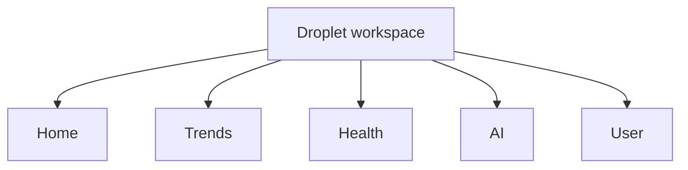
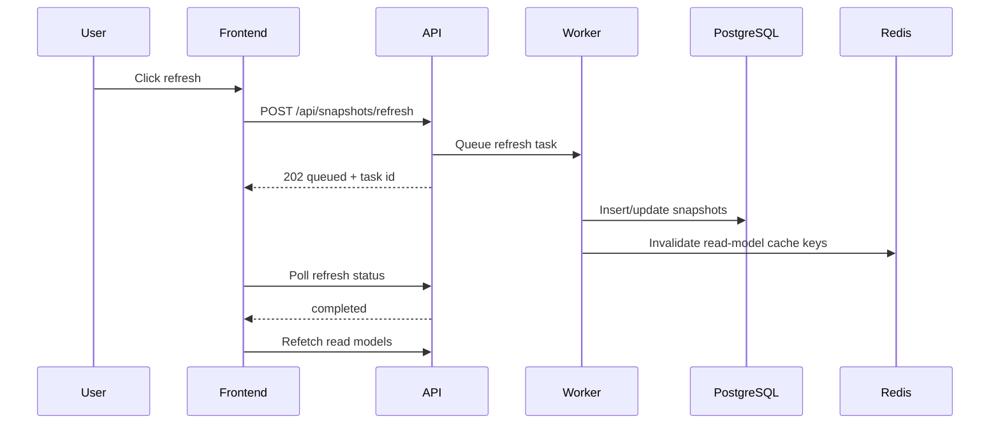

# How to Use Droplet

Droplet is an operational workspace for reviewing water-state conditions across German federal states. It combines current reservoir snapshots, trend history, source health, forecast pressure, and optional AI analysis.

## Start The App

Run the full local stack:

```bash
docker compose up --build
```

Open the frontend at:

```text
http://localhost:5173
```

The backend health endpoint is:

```text
http://localhost:5000/healthz
```

By default the app runs in demo auth mode. Demo mode signs in as `Droplet Analyst` and enables citizen, analyst, and municipality features.

## Navigation



## Home

The Home page is the main operations view.

- The workspace shell uses a collapsible sidebar for navigation, refresh state, session controls, and state search.
- The D3 Germany state canvas supports pan, zoom, reset, fit-to-view, selected-state focus, pointer selection, and keyboard state selection.
- Home layers are Overview, Water, Climate, Forecast, and Data quality. Overview blends the other four signals into one operational score.
- Regional filters narrow visible states by status or risk profile without switching into water-system-only map modes.
- Selecting a state updates the right rail with region metadata, water snapshot, climate context, forecast outlook, source tags, warnings, and read-model freshness.
- On mobile, selected-state details open in a responsive sheet while navigation remains in the sidebar drawer.
- Offline state is detected in the browser, and cached read models remain labeled through the freshness panel.

Climate context is supplemental. It does not change the persisted reservoir snapshot and should not block water-state review if a climate source is pending, partial, or unavailable. CO2 appears as candidate source metadata rather than a live measured score.

Climate data is refreshed through backend workers. On a cold cache, the panel can show pending climate context while a region refresh is queued. On stale cache, the panel keeps showing the cached context and labels whether refresh is queued, pending behind an existing lock, failed, or idle.

## Trends

The Trends page focuses on historical movement for the selected region.

- Snapshot history is loaded from `/api/snapshots/<region_id>`.
- Analyst and citizen users receive shorter history than municipality users.
- Municipality users can request up to 365 records.
- The page is useful for comparing rising, falling, and stable conditions over time.

## Health

The Health page explains operational data reliability.

- Source health summarizes current source coverage and confidence.
- Ingestion status reports the latest snapshot refresh state.
- Freshness panels show when important read models were last loaded by the frontend.
- Manual refresh starts a new ingestion job when the user has an analyst or municipality role.

## AI

The AI page sends selected water-state payloads to the backend for analysis.

- The backend calls Gemini only when `GEMINI_API_KEY` is configured.
- AI output is returned as short JSON-backed observations, recommendations, risk level, scope label, and summary.
- Completed AI analyses are saved per user and can be listed later.
- Role context affects the prompt: municipality users receive the most operationally specific analysis.

## User

The User page shows the active identity and role set.

- Demo auth uses a built-in local user.
- Keycloak auth uses the imported `droplet` realm.
- Role-gated actions require `analyst` or `municipality`.

## Refreshing Data

The refresh button has three meanings:

- `Current`: latest read models loaded successfully.
- `Syncing`: the frontend is refetching read models.
- `Stale`: cached data is available but should be refreshed.

When a manual snapshot refresh is allowed, the frontend posts to `/api/snapshots/refresh`, receives a task id, then polls `/api/snapshots/refresh/<task_id>` until the job completes or fails.



## Roles

| Role | Can read basic state | Can view operations read models | Can refresh snapshots | History depth |
|---|---:|---:|---:|---:|
| `citizen` | Yes | Limited | No | Up to 90 |
| `analyst` | Yes | Yes | Yes | Up to 365 |
| `municipality` | Yes | Yes | Yes | Up to 365 |

## Demo Fallback

The frontend can fall back to demo data for non-auth API failures when `VITE_DEMO_FALLBACK` is not `false`. Authentication errors do not use demo fallback because they represent invalid or expired sessions.
